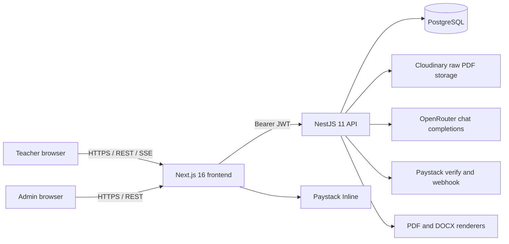
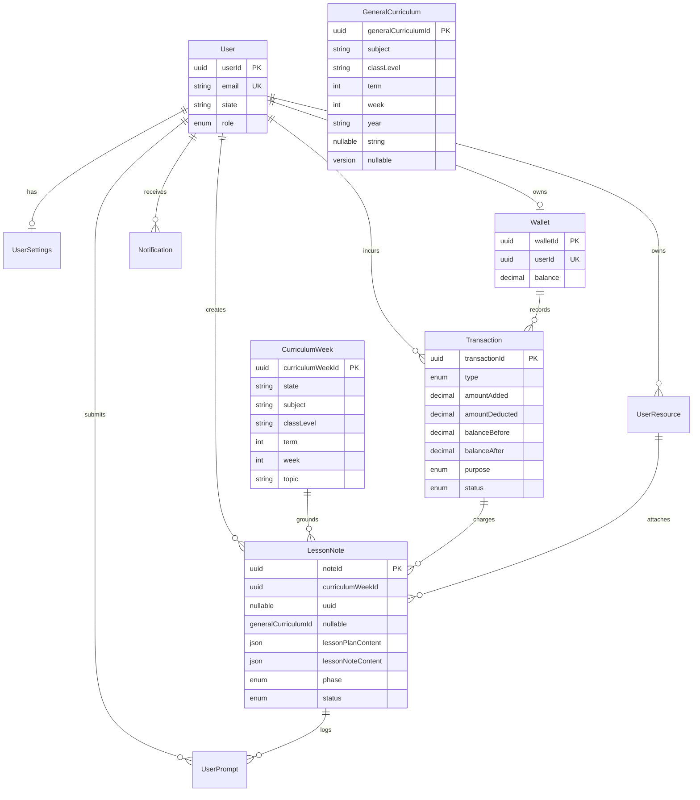
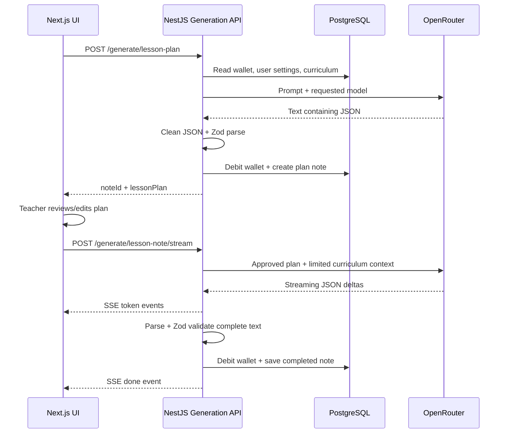

# SabiNote v1 Architecture and API Baseline

**Status:** Code-derived baseline for SabiNote v2 planning  
**Verified against:** backend `master` at `b74b53699c85deb4a89177853d7a2d1cfbf0d0c9` and frontend `master` at `f604737785539c5c5aebb6d852f751d8da6e71cb`  
**Last reviewed:** 2026-09-27  
**API prefix:** `/api/v1`

This document records what the current repositories implement. It is not the v2 design and does not replace controller code, Prisma migrations, or endpoint tests as the final source of truth. `API_DOCS.md` remains the detailed payload guide, but this baseline identifies mismatches and constraints that the v2 migration must address.

## 1. System context

### Frontend

- Next.js `16.2.6`, React `19.2.4`, TypeScript and Tailwind CSS 4.
- Redux Toolkit Query supplies API clients, caching tags and token refresh.
- Default API URL is `http://localhost:3000/api/v1`; production uses `NEXT_PUBLIC_API_URL`.
- Access and refresh tokens are held in Redux state. On a 401, the base query calls `/auth/refresh`, updates credentials, and retries once.
- Teacher routes cover dashboard, generation, notes, wallet, resources and settings.
- Admin routes cover overview, users, curriculum and public resources.

### Backend

- NestJS `11`, Prisma `7.8`, PostgreSQL and Zod `4.4`.
- Global route prefix: `/api/v1`.
- Global validation strips no fields silently: whitelisting and `forbidNonWhitelisted` are enabled.
- CORS uses `CORS_ORIGIN` when configured and otherwise allows all origins while credentials are enabled. Production must not rely on the wildcard fallback.
- Main modules: Auth, Users, Wallet, Curriculum, Notes, Notifications, Generation, Resources, Export and Admin.
- Cache-manager wraps selected curriculum and user-setting reads.

## 2. Current domain model

### Important constraints

- `CurriculumWeek` is unique by state, subject, class, term and week.
- `GeneralCurriculum` is unique by subject, class, term, week and nullable year. PostgreSQL nullable uniqueness does not prevent multiple otherwise identical rows when `year` is null.
- `LessonNote` has a Prisma relation to state curriculum but stores only a scalar ID for general curriculum.
- A note stores generated JSON, but not an immutable curriculum snapshot, prompt version, schema version, resolved model/provider, retrieved sources or generator release.
- `Wallet.balance` is mutable and has no balance provenance. Transactions distinguish credit/debit and purpose, but not purchased, promotional or earned Parats.

## 3. Authentication and authorization

- Public endpoints: root health-style response, registration, login and Paystack webhook.
- Authenticated endpoints use `JwtAuthGuard`.
- Administrative endpoints combine `JwtAuthGuard` and `AdminGuard` or add `AdminGuard` to an authenticated curriculum controller.
- Roles are currently `teacher` and `admin`; v2 requires finer-grained operational roles and separation of duties.
- Logout is stateless and does not revoke a refresh token server-side.

## 4. Implemented API inventory

All paths below are relative to `/api/v1`.

| Method | Path | Access | Current purpose |
|---|---|---|---|
| GET | `/` | Public | Basic application response |
| POST | `/auth/register` | Public | Create teacher and related account records |
| POST | `/auth/login` | Public/local guard | Issue access and refresh tokens |
| POST | `/auth/refresh` | Refresh token | Rotate token pair |
| POST | `/auth/logout` | Authenticated | Client-side logout acknowledgement |
| GET | `/auth/me` | Authenticated | Current account/profile summary |
| GET | `/users/profile` | Authenticated | Profile |
| PATCH | `/users/profile` | Authenticated | Update name, phone or state |
| GET | `/users/settings` | Authenticated | Generation preferences |
| PATCH | `/users/settings` | Authenticated | Update defaults and difficulty |
| DELETE | `/users/account` | Authenticated | Delete account through service policy |
| GET | `/wallet` | Authenticated | Current mutable Parat balance |
| GET | `/wallet/transactions` | Authenticated | Paginated transaction history |
| GET | `/wallet/packages` | Authenticated | Server-configured purchase packages |
| POST | `/wallet/topup/initiate` | Authenticated | Create pending top-up transaction/reference |
| POST | `/wallet/topup/verify` | Authenticated | Verify Paystack transaction and credit wallet |
| POST | `/wallet/topup/manual` | Authenticated | Temporary development-only top-up |
| POST | `/wallet/webhook` | Public, HMAC checked | Process successful Paystack charges |
| GET | `/curriculum/states` | Authenticated | State list |
| GET | `/curriculum/subjects` | Authenticated | State/general fallback-aware subjects |
| GET | `/curriculum/weeks` | Authenticated | Week topics with `state` or `general` source |
| GET | `/curriculum/week` | Authenticated | State-preferred week details |
| POST | `/curriculum/seed` | Admin | Seed state-specific rows |
| POST | `/curriculum/general/seed` | Admin | Seed national/general rows |
| POST | `/generate/lesson-plan` | Authenticated | Generate, charge and save a draft plan |
| POST | `/generate/lesson-note` | Authenticated | Generate, charge and save a complete note |
| POST | `/generate/lesson-note/stream` | Authenticated | Stream raw model deltas, then validate/save |
| POST | `/generate/regenerate` | Authenticated | Replace a plan or note for a regeneration fee |
| GET | `/notes` | Authenticated | Paginated note library |
| GET | `/notes/search` | Authenticated | Search owned notes |
| GET | `/notes/:noteId` | Authenticated/owner | Note details |
| PATCH | `/notes/:noteId` | Authenticated/owner | Update plan/note content |
| DELETE | `/notes/:noteId` | Authenticated/owner | Delete note |
| GET | `/notifications` | Authenticated | Paginated notifications |
| PATCH | `/notifications/read-all` | Authenticated | Mark all read |
| PATCH | `/notifications/:id/read` | Authenticated | Mark one read |
| GET | `/resources` | Authenticated | Owned and public resource metadata |
| POST | `/resources/upload` | Authenticated | Upload a PDF to Cloudinary |
| DELETE | `/resources/:resourceId` | Authenticated/owner | Delete metadata and Cloudinary object |
| GET | `/resources/match` | Authenticated | Latest public exact-match resource |
| POST | `/export/:noteId/pdf` | Authenticated/owner | Download generated PDF |
| POST | `/export/:noteId/docx` | Authenticated/owner | Download generated DOCX |
| GET | `/admin/users` | Admin | Paginated users |
| GET | `/admin/stats` | Admin | Basic user/note/top-up counts |
| POST | `/admin/curriculum/seed` | Admin | Alternate state curriculum seed route |
| POST | `/admin/credit` | Admin | Direct wallet credit |
| GET | `/admin/transactions` | Admin | Paginated global transactions |
| POST | `/admin/resources/upload` | Admin | Upload public PDF resource |

### Documentation drift detected

The frontend `API_DOCS.md` does not currently document all live routes. At minimum it omits:

- `GET /wallet/packages`
- `POST /wallet/topup/manual`
- `POST /curriculum/general/seed`
- `POST /generate/lesson-note/stream`

The backend `API_DOCS.md` is more complete but still does not include all of these routes and identifies an AI default that differs from code. Future API documentation should be generated from an OpenAPI contract and checked in CI.

## 5. Current generation sequence

### Current AI configuration

- Gateway: OpenRouter `/chat/completions`.
- Code fallback model: `google/gemini-flash-1.5`.
- Plan default maximum: 3,000 output tokens.
- Note default maximum: 5,000 output tokens.
- Non-stream timeout: 60 seconds; stream timeout: 120 seconds.
- Transient non-stream errors are retried; streaming has no retry after opening.
- Text is manually cleaned, `JSON.parse`d and checked with Zod.
- The requested model is logged, but the resolved provider/model, latency, monetary cost, prompt/schema versions and validation errors are not.
- Uploaded resource content is not read or added to model context. Only `resourceId` may be linked to the note.

## 6. Current wallet and payment behavior

- Packages are configured server-side through `PARATS_PACKAGES`.
- Paystack Inline runs in the frontend; backend verification and webhook processing credit Parats.
- `amountAdded` stores Parats rather than Naira, although an admin aggregate labels this sum as Naira revenue. That statistic is semantically incorrect.
- A successful top-up updates the mutable balance and transaction in one Prisma transaction.
- Idempotency checks reduce duplicate top-up crediting, but balance updates are calculated from previously read values and are not a complete concurrency-control strategy.
- Generation similarly checks balance before the AI call and later writes a calculated balance. Concurrent generation can lead to inconsistent charging or overwrites.
- V2 must introduce provenance-aware, atomic ledger operations before cash redemption is enabled.

## 7. Current resource behavior

- Only PDFs are accepted; MIME type and `%PDF` magic bytes are checked.
- Teacher uploads are private; admin uploads can be public.
- Raw PDFs are stored in Cloudinary.
- There is no malware scanner, OCR, personal-data detection, redaction, rights declaration, content version, duplicate detection, moderation, retrieval index or licence record.
- Resource matching is an exact state/subject/class lookup returning the newest public resource.

## 8. V2 architectural boundaries

The v2 design must preserve working v1 behavior behind compatibility adapters while introducing bounded modules for:

1. Curriculum release/import/publication.
2. Curriculum-grounded generation and evaluation.
3. Contributor intake, rights, review and retrieval.
4. Provenance-aware Parat ledger and reward engine.
5. Naira conversion, KYC and payout orchestration.
6. Audit, risk, privacy and operations.

The frontend may remain a modular Next.js application and the backend a modular NestJS application for v2.0. A microservice split is not a prerequisite. Asynchronous file processing, indexing and payouts should use durable jobs/outbox events even if workers initially deploy with the same codebase.

## 9. Known verification gaps

- No generation-specific test suite or quality benchmark was found.
- Backend dependencies were not installed in this checkout, so tests were not executed during the original audit.
- Production environment values, deployed model, provider privacy settings and payment configuration are not represented in the repositories.
- API docs are manually maintained and have drifted from controllers.
- Regulatory classification, licensing terms, tax treatment and payout-provider support require current professional verification before contributor payments launch.

