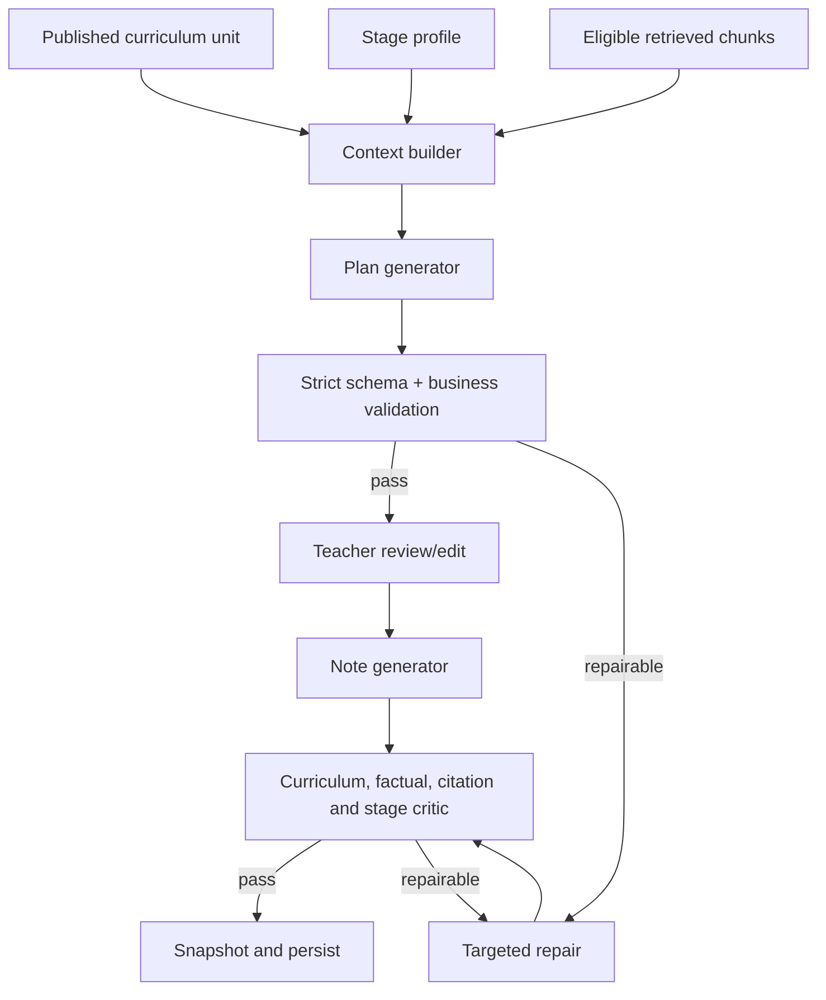
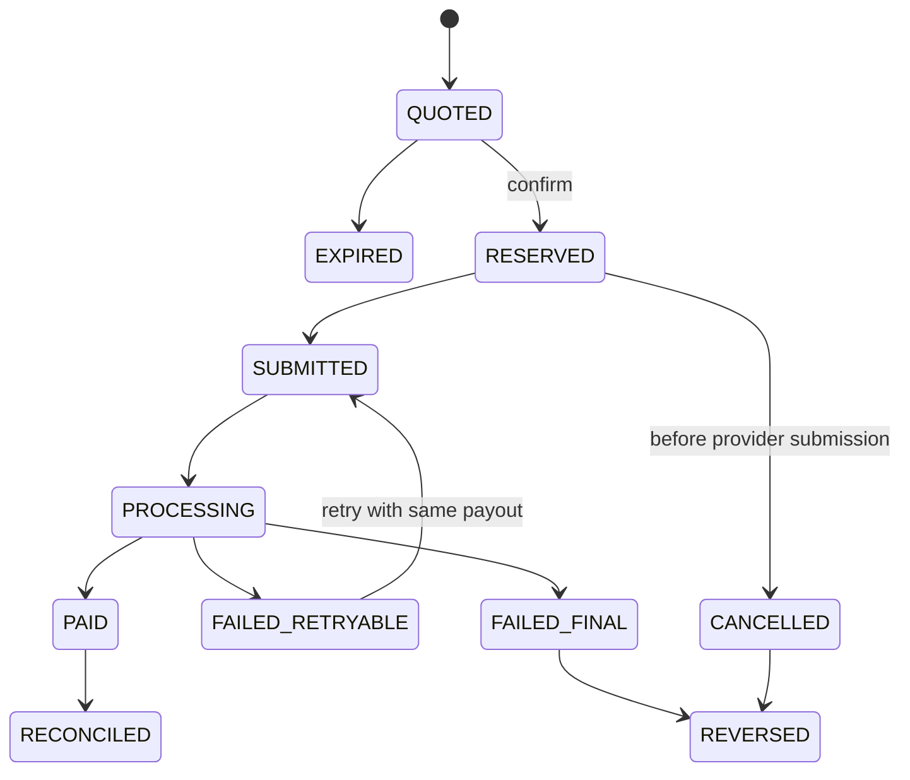
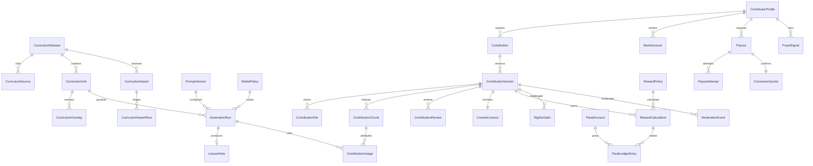

# SabiNote v2.0 Product Requirements Document

## 1. Document control

| Field | Value |
|---|---|
| Product | SabiNote |
| Proposed application release | `v2.0.0` baseline with phased `v2.0.1`-`v2.0.6` buildout |
| PRD version | `1.1-draft` |
| Status | Draft for product, technical, curriculum and compliance review |
| Product and frontend owner | Evander Ikechukwu (PM/Frontend) |
| Engineering and architecture owner | Emmanuel Olajide (CTO) |
| Legal and compliance owner | Bamidele Olatunji (Legal/Compliance) |
| Curriculum acceptance owner | Evander Ikechukwu, with an independent curriculum specialist required for source approval |
| Finance/risk accountability | Emmanuel Olajide (technical controls) and Bamidele Olatunji (compliance), with qualified finance/payment advice required before payout |
| Date | 2026-09-28 |

### Change log and approval

| Version | Change | Author | Approval |
|---|---|---|---|
| 1.0-draft | Initial integrated v2 PRD | SabiNote product team | Pending |
| 1.1-draft | Added phased v2 release train, named core-team ownership, architecture/API gap remediation and future data strategy | SabiNote product team | Pending |

Approval requires Product, Engineering, Curriculum, Security/Privacy and Finance/Risk. Contributor payouts additionally require qualified Nigerian legal, tax and payment-provider review.

## 2. Executive summary

SabiNote v2.0 transforms the current AI lesson-document generator into a versioned, source-grounded and teacher-contributed Nigerian education platform. It retains the useful plan-then-note workflow, exports and Parat payments while replacing weak curriculum selection, ungrounded generation and mutable wallet accounting with release governance, retrieval, reproducible AI runs and an immutable provenance-aware ledger.

The release has four product pillars:

1. **Published curriculum:** immutable releases for Early Years, Primary, JSS and SSS, with provenance, validation, approval, diff and supersession.
2. **Grounded AI:** stage-specific generation from the exact curriculum unit and approved retrieved sources, followed by deterministic validation and targeted quality repair.
3. **Teacher knowledge marketplace:** verified teachers license useful original resources; SabiNote sanitizes, reviews, versions and indexes accepted material.
4. **Trusted rewards:** one `$Parats` brand backed by separate `PURCHASED`, `PROMOTIONAL` and `EARNED` provenance. Only Earned Parats can be converted to Naira; all Parats are non-transferable.

The recommended MVP comprises curriculum releases, grounded generation, provenance snapshots, contributor intake/review, Earned Parat awards and a controlled payout pilot. Broad public uploads, usage royalties and fine-tuning follow only after fraud, rights, privacy and unit-economics gates pass.

## 3. Vision and product principles

**Vision:** Every Nigerian teacher can produce trustworthy, locally useful lessons from the curriculum while experienced teachers are fairly rewarded for contributing licensed classroom knowledge.

Principles:

- Curriculum determines coverage; AI transforms rather than invents it.
- Every published artifact is reproducible from versioned inputs.
- Teachers retain review and editing authority.
- Contributors are paid for accepted value, not upload volume.
- Provenance survives ingestion, generation, spending and payout.
- Privacy, copyright and financial integrity are product behavior, not policy text alone.
- Published releases are immutable; corrections create new versions.
- Human review governs ambiguous rights, high-risk content and material financial exceptions.
- AI quality is measured against teacher-reviewed cases.
- Migration is additive, observable and reversible.

## 4. Current-state assessment

The verified baseline is documented in `ARCHITECTURE_API_BASELINE.md`. Today, two flat curriculum tables supply a two-stage OpenRouter workflow. Generated JSON is Zod-validated, charged and saved. Resources are raw PDFs in Cloudinary but are not read by generation. Wallet truth is a mutable balance supported by transaction rows without value provenance.

Key gaps are release identity, rich source preservation, canonical taxonomy, strict structured output, factual validation, RAG, contributor rights/moderation, wallet concurrency, redeemable-value separation, payout controls, operational roles and quality metrics. Existing API documents also drift from controllers.

### 4.1 Architecture and API gaps that v2 must close

`ARCHITECTURE_API_BASELINE.md` is the code-derived baseline for this PRD. The handwritten `API_DOCS.md` is useful background but is not an authoritative contract until it is reconciled with the controllers and generated from code. The following findings are explicit v2 scope, not optional cleanup.

| ID | Verified gap or risk | Required remediation | First release | Accountable owner |
|---|---|---|---|---|
| `ARCH-001` | Live controller routes omitted from current API documentation: `GET /wallet/packages`, `POST /wallet/topup/manual`, `POST /curriculum/general/seed` and `POST /generate/lesson-note/stream` | Inventory every live route; classify public/admin/internal/dev; generate OpenAPI; create typed frontend client and CI contract-drift check | `2.0.1` | Emmanuel |
| `ARCH-002` | Documentation names a different default model from the backend fallback | Resolve model through a versioned model policy and record requested/resolved provider and model for every run; remove defaults from narrative docs | `2.0.2` | Emmanuel |
| `ARCH-003` | Configuration has no startup schema validation; unsafe combinations can reach runtime | Validate environment variables and fail closed for production secrets, database, object store, model provider, payment provider and allowed origins | `2.0.1` | Emmanuel |
| `ARCH-004` | Production CORS can fall back to wildcard while credentials are enabled | Require an explicit production allow-list and test rejected origins | `2.0.1` | Emmanuel |
| `ARCH-005` | Access tokens can be refreshed, but refresh/logout sessions are not server-revocable | Introduce hashed refresh-session records, rotation, reuse detection, device/session logout and administrative revocation | `2.0.1` | Emmanuel |
| `ARCH-006` | Roles are currently only teacher/admin and cannot enforce curriculum, content, rights, finance and support separation | Add scoped RBAC/permissions, MFA for privileged roles and audited break-glass access | `2.0.3` | Emmanuel; Bamidele approves control design |
| `ARCH-007` | Curriculum is flat, year semantics are nullable, and notes lack an enforced curriculum relation | Add canonical entities, immutable releases and database relations/snapshots; remove ambiguous nullable uniqueness from v2 writes | `2.0.1` | Emmanuel |
| `ARCH-008` | Uploaded resources are stored but not used in generation | Quarantine, extract, sanitize, review, chunk and retrieve only eligible content; store chunk-level attribution | `2.0.3` | Emmanuel; Bamidele approves rights/privacy gates |
| `ARCH-009` | Model output relies on manual JSON cleanup and weak run telemetry | Use provider-native structured output where supported plus strict validation/repair; record latency, tokens, cost, prompt/schema/model-policy versions and failure class | `2.0.2` | Emmanuel |
| `ARCH-010` | Wallet truth is a mutable balance; reads can become stale during concurrent generations/top-ups | Replace financial truth with atomic, idempotent, double-entry postings and reservations; retain balance only as a verified projection | `2.0.4` | Emmanuel |
| `ARCH-011` | Manual top-up is an authenticated live route without a clear production environment/admin guard | Remove it from production or guard it as a non-production fixture; all real funding must use verified provider callbacks and idempotency | `2.0.1` | Emmanuel |
| `ARCH-012` | Admin statistics label Parat credits as Naira revenue | Define accounting units and metric semantics; never infer currency revenue from token credits | `2.0.1` | Evander defines metric; Emmanuel implements; Bamidele reviews claims |
| `ARCH-013` | Lesson-note update DTOs accept strings while persisted plan/note content is JSON | Publish canonical request/response schemas, migrate incompatible clients and add contract tests | `2.0.1` | Emmanuel and Evander |
| `ARCH-014` | Error shapes, pagination, idempotency and deprecation behavior are not consistently specified | Standardize `/api/v2` error envelopes, cursor pagination, idempotency keys, correlation IDs, rate limits and sunset headers | `2.0.1` | Emmanuel |

Architecture completion means the generated OpenAPI artifact, implementation, typed frontend calls and automated contract tests agree. Undocumented live production endpoints are release blockers. Dev-only helpers must be structurally unavailable in production rather than merely absent from documentation.

## 5. Problem statement

| Stakeholder | Problem |
|---|---|
| Teacher | A polished output may still be wrong, age-inappropriate or based on the wrong curriculum edition. |
| Contributor | There is no safe, transparent way to license useful work, correct extraction or earn rewards. |
| Curriculum team | Imports are flat seeds without preview, provenance, approval or immutable publication. |
| Reviewer | No queue, rubric, evidence view, conflict control or appeal workflow exists. |
| Finance | Existing balances cannot distinguish purchased, promotional and redeemable value. |
| Engineering | Model, prompt, schema and curriculum changes cannot be reproduced as one generation release. |
| Rights holder | There is no notice, evidence, takedown, suspension or repeat-infringer workflow. |
| Regulator/auditor | Personal-data handling, cross-border AI use, financial controls and audit evidence are incomplete. |

## 6. Goals, outcomes and non-goals

### Goals

- `G1` Publish complete, validated curriculum releases with at least 99.5% expected unit coverage and zero silent mutation.
- `G2` Make every new generation traceable to curriculum, prompt, schema, model policy and retrieved sources.
- `G3` Reduce unsupported references to below 1% in the launch evaluation set.
- `G4` Achieve at least 85% teacher acceptance without full regeneration in the controlled pilot.
- `G5` Accept and reward teacher contributions through transparent review, rights and privacy controls.
- `G6` Guarantee by invariant that purchased/promotional Parats never fund a withdrawal.
- `G7` Reconcile 100% of completed payouts to internal ledger entries and provider records.

### Non-goals for 2.0 launch

- Training a foundation model on all uploads.
- Peer-to-peer Parat transfer, lending, trading or floating exchange value.
- Replacing licensed curriculum experts with automated approval.
- A microservice rewrite solely for architectural fashion.
- Public resale or download of raw contributor files.
- Automatic acceptance of scanned textbooks.
- Nationwide institutional procurement features; design extension points only.

## 7. Personas and jobs to be done

- **Classroom teacher:** “When I select a week, give me a source-grounded plan I can check and teach.”
- **Teacher contributor:** “When I share original work, explain its status, protect my rights and pay me predictably if accepted.”
- **Curriculum reviewer:** “Show extracted rows beside source evidence so I can approve a complete release.”
- **Content reviewer:** “Give me sanitized content, similarity evidence and a stable rubric before I decide.”
- **Rights administrator:** “Trace every use of disputed content and stop new retrieval without destroying audit evidence.”
- **Finance/payout administrator:** “Approve exceptional payouts without being able to alter content rewards or ledger history.”
- **Support agent:** “Explain status using safe operational views without broad access to files or bank data.”
- **Auditor:** “Reconstruct who approved, generated, rewarded, converted and paid each event.”

## 8. Scope matrix

| Capability | v2 MVP | Later | Out of scope |
|---|---:|---:|---:|
| Curriculum release/import/publish | Yes |  |  |
| BEC, SSEC and submitted Early Years/Primary sources | Yes |  |  |
| Stage-specific grounded plan/note generation | Yes |  |  |
| Teacher upload, redaction, review and RAG | Pilot | Public scale |  |
| Fixed acceptance/quality rewards | Pilot | Dynamic scarcity/usage |  |
| Earned Parat spending and limited withdrawal | Pilot | Broad rollout |  |
| Usage attribution | Basic | Advanced revenue share |  |
| Fine-tuning |  | Conditional experiment | Raw-upload training |
| School/institution accounts |  | Candidate |  |
| Peer-to-peer Parat transfer |  |  | Never in v2 |

## 9. End-to-end journeys

### 9.1 Generate a lesson

Teacher selects stage, class, subject, jurisdiction, release, term, week and duration. SabiNote resolves one published unit, displays its source/release, retrieves eligible supporting chunks, creates an idempotent generation run and reserves spendable Parats. The plan is strictly generated and validated. The teacher reviews or edits it, then requests the note. The note passes structural, curriculum, reference and stage checks; failed sections are repaired. On success the reservation posts as spent and the immutable provenance snapshot is saved. On terminal failure it is released.

### 9.2 Contribute material

Contributor verifies identity, selects metadata, uploads a supported file, accepts the current licence and confirms authority. The file is quarantined, scanned, extracted and redacted. The contributor approves the sanitized representation. Similarity, curriculum classification, quality and rights checks create a review package. A reviewer accepts, requests correction or rejects with reason codes. Acceptance creates an immutable contribution version, indexable chunks and a pending reward. After the hold period, Earned Parats become available.

### 9.3 Withdraw Earned Parats

Contributor verifies identity and a same-name bank account, requests a quote and sees the fixed versioned conversion rate and fee. SabiNote atomically reserves only available Earned Parats, records an idempotent payout and sends it through an approved provider. Signed webhooks and scheduled reconciliation settle, retry or reverse the reservation. Purchased and promotional entries are ineligible at query and database-rule levels.

### 9.4 Dispute or takedown

A claimant submits evidence. Rights administrators preserve the original record, suspend new retrieval, hold unsettled related rewards and notify the contributor. A separated reviewer decides reinstate, retire or remove according to policy. Appeals create a new decision; history is never overwritten. Previously generated user documents remain recorded, while future use stops unless counsel requires additional action.

### 9.5 Publish a curriculum release

An administrator registers sources and checksums, selects an extraction profile and imports into draft. Validation reports missing weeks, duplicates, invalid taxonomy and source gaps. Reviewers inspect row-to-page evidence and compare with the active release. Two-person approval publishes an immutable release and changes the active pointer atomically. Correction uses a superseding release, never an edit.

## 10. Information architecture and UX

P0 pages are: curriculum-aware Generate; plan editor; note/source viewer; Contribution dashboard and upload wizard; contribution detail/correction; wallet breakdown; bank account and withdrawal; curriculum release list/import/validation/diff; contribution review; rights queue; payout/reconciliation; fraud case; AI-quality dashboard; audit viewer.

Every page shall define loading, empty, success, validation, partial-processing, permission, suspension, retry and support states. WCAG 2.2 AA is the target. All teacher journeys must work at 360 px width with keyboard and screen-reader access. Financial confirmation must display amount, provenance eligibility, rate version, fee and resulting balances before submission.

## 11. Curriculum release management

### Requirements

- `CUR-001 P0` A `CurriculumRelease` has code, framework, authority claim, provenance status, academic/effective dates, semantic revision, status, source set and supersession link.
- `CUR-002 P0` Statuses are `DRAFT`, `VALIDATING`, `READY_FOR_REVIEW`, `APPROVED`, `PUBLISHED`, `SUPERSEDED`, `RETIRED`, `FAILED`.
- `CUR-003 P0` Publication is immutable and requires separate preparer and approver identities.
- `CUR-004 P0` `CurriculumSource` stores original filename, checksum, page count, issuer claim, verified issuer, acquisition evidence and rights/usage classification.
- `CUR-005 P0` `CurriculumUnit` uses canonical stage/class/subject/term/week/jurisdiction keys and rich normalized fields: topic, content, subtopics, objectives, teacher activities, learner activities, resources, assessment, references and safety notes.
- `CUR-006 P0` `sourceColumns` JSON preserves heterogeneous table strands such as Speech Work, Grammar, Composition and Literature; normalization must not destroy them.
- `CUR-007 P0` Every extracted value can point to source document, page and row/region where available.
- `CUR-008 P0` Validation detects duplicate keys, missing expected teaching weeks, unknown taxonomy, assessment/break rows, empty topics, out-of-range terms/weeks and coverage changes.
- `CUR-009 P0` Imports provide preview, downloadable errors and diff against a selected release before approval.
- `CUR-010 P0` Active release resolution is deterministic by framework, stage, effective date and jurisdiction; a state overlay may replace specified units while inheriting the national base.
- `CUR-011 P1` Import profiles support PDF/OCR, CSV, XLSX and reviewed JSON without treating document text as executable instructions.
- `CUR-012 P0` Generated notes store a curriculum snapshot or canonical snapshot hash that remains valid after supersession.

**Provenance decision:** the submitted Early Years/Primary PDF's NERDC/NAPPS alignment statements are unverified claims until supported by issuer evidence. Use `SABINOTE-ECE-2025.1` rather than `NAPPS-ECE-2025.1` unless NAPPS provenance is verified.

**Acceptance:** Given a published release, when any unit is edited, then the write is rejected and a new draft revision is required. Given an import with duplicate canonical keys, when validation completes, then publication is blocked and each conflict links to source evidence.

## 12. AI generation architecture

- `AI-001 P0` Create versioned profiles for Early Childhood, Lower Primary, Upper Primary, JSS and SSS.
- `AI-002 P0` Generation context contains the exact unit, source provenance, approved plan and only rights-eligible sanitized retrieval chunks.
- `AI-003 P0` Use provider-native strict structured output where supported; the Zod/JSON schema and prompt quantities derive from one versioned contract.
- `AI-004 P0` Business validation confirms immutable metadata, objective-to-evaluation coverage, duration tolerance, required subtopic coverage and stage rules.
- `AI-005 P0` References may name a book/page only when supplied by an approved source. Unsupported references are omitted or generically labelled.
- `AI-006 P0` `GenerationRun` records idempotency key, curriculum snapshot, sources, generator/prompt/schema/model-policy versions, requested and resolved model/provider, parameters, latency, tokens, cost estimate, validations, repairs and outcome.
- `AI-007 P0` Charging uses reserve/commit/release and cannot charge the same run twice.
- `AI-008 P0` Streaming is UX-only; the final validated server record is authoritative. Disconnect policy is explicit and recoverable by run ID.
- `AI-009 P1` The critic reports violations and targeted patches; it does not silently replace a passing document.
- `AI-010 P0` Uploaded text is delimited as untrusted reference content and cannot change system instructions.
- `AI-011 P1` Teacher regeneration can target a section and must preserve unaffected approved sections and provenance.
- `AI-012 P0` Provider policy supports privacy controls, timeout, bounded retry, circuit breaking and evaluated fallbacks.

Validation levels are distinct: structural, deterministic curriculum, factual/domain, mathematical, age/developmental, safety and citation. A pass at one level never implies another.

## 13. AI evaluation and observability

`AI-EVAL-001 P0` Establish a teacher-approved golden set spanning all five stages, three terms, state/national variants and language, mathematics, science, humanities, creative, vocational and religious subjects. Each release gates curriculum adherence, factual correctness, age appropriateness, objective-assessment alignment, Nigerian practicality and reference support.

Operational metrics include success, strict-schema failure, repair, timeout, provider error, unsupported citation, teacher acceptance, edit distance, regeneration, p50/p95/p99 latency, tokens, estimated cost and attribution coverage. Model changes run blind comparisons, regression tests and a canary before promotion. Raw prompt text must be access-restricted and retention-controlled; dashboards use redacted metadata.

Recommended launch gates: 0 critical curriculum omissions; >=95% structural first-pass; >=99% after one repair; >=90% supported-reference precision; >=85% teacher acceptance in pilot; no statistically meaningful regression from the approved baseline.

## 14. Contributor intake and processing

- `CONTRIB-001 P0` Accept PDF, DOCX and images only through allowlisted type, size and page limits; detect true type and scan malware before processing.
- `CONTRIB-002 P0` Keep the raw file in encrypted quarantine; downstream services use a sanitized derivative.
- `CONTRIB-003 P0` Run OCR/extraction with page coordinates and confidence; allow contributor correction without altering the raw checksum.
- `CONTRIB-004 P0` Detect and redact student/parent names, IDs, grades, contact, health/disability data, faces and signatures; require contributor confirmation.
- `CONTRIB-005 P0` Bind every submission to an identity, rights attestation and licence version.
- `CONTRIB-006 P0` Combine exact file, normalized text, page-level and semantic similarity checks.
- `CONTRIB-007 P0` Classify stage, class, subject, term, week, curriculum match and document type with confidence and human correction.
- `CONTRIB-008 P0` State machine: `DRAFT -> UPLOADED -> PROCESSING -> SANITIZATION_CONFIRMATION -> UNDER_REVIEW -> ACCEPTED|NEEDS_CORRECTION|REJECTED`; accepted versions may become `DISPUTED`, `SUSPENDED` or `RETIRED`.
- `CONTRIB-009 P0` Rejected, suspended, disputed and retired content is excluded from new retrieval through one authoritative eligibility predicate.
- `CONTRIB-010 P1` Fine-tuning eligibility is a separate explicit consent and approval state; acceptance for RAG does not imply it.

## 15. Contributor quality and reputation

Review rubric dimensions are curriculum alignment, correctness, originality, completeness, pedagogy, age fit, classroom practicality, language clarity, assessment quality, privacy and rights confidence. Automated scores prioritize queues but cannot conclusively determine ownership.

Reputation levels are New, Verified, Trusted and Master. Promotion requires minimum reviewed contributions, sustained quality and no unresolved material dispute; demotion uses documented events and appeal. Trusted status may reduce sampling, never bypass malware, privacy, similarity or rights checks. Reviewers receive calibration cases; quality and payout exceptions require separate people.

## 16. Retrieval and attribution

- `RAG-001 P0` Chunk along semantic sections and page boundaries; retain contribution version, source page, rights status and curriculum taxonomy.
- `RAG-002 P0` Filter before ranking by eligibility, stage, class, subject, release compatibility, language, jurisdiction and status.
- `RAG-003 P0` Rank exact curriculum alignment above semantic similarity and reputation; diversity limits prevent one contributor dominating context.
- `RAG-004 P0` Generation records every retrieved and actually supplied chunk.
- `RAG-005 P0` User-visible citations identify source type and contribution attribution permitted by licence without exposing the raw file.
- `RAG-006 P0` Retirement updates the eligibility index promptly while keeping historical generation evidence.
- `RAG-007 P1` Usage attribution only rewards material contribution above a documented threshold and is protected from self-use and collusion.

## 17. Parats wallet and immutable ledger

### Confirmed rules

| Provenance | Spend on SabiNote | Convert/withdraw | Transfer |
|---|---:|---:|---:|
| `PURCHASED` | Yes | No | No |
| `PROMOTIONAL` | Yes | No | No |
| `EARNED` | Yes | Yes | No |

Purchased and promotional Parats are consumed before Earned Parats by default. The UI shows total, spendable, withdrawable, pending, held and lifetime earned values. Balance mixing, refund or adjustment must never change provenance eligibility.

- `WALLET-001 P0` Use immutable double-entry postings with balanced debits/credits and integer minor units or exact decimals.
- `WALLET-002 P0` Accounts separate provenance and state: pending, available, reserved, held, spent, converted, payout-pending, paid and reversed.
- `WALLET-003 P0` Derived balances are projections of ledger truth; mutable cached balances are rebuildable and reconciled.
- `WALLET-004 P0` Every command has an idempotency key, actor, reason, source object and policy version.
- `WALLET-005 P0` Spending atomically allocates eligible lots in configured order; insufficient balance cannot race past a concurrent spend.
- `WALLET-006 P0` Conversion reserves specific available Earned postings; they cannot be spent or converted again.
- `WALLET-007 P0` Adjustments use compensating entries, dual authorization above thresholds and no destructive edits.
- `WALLET-008 P0` Existing balances migrate as non-withdrawable `LEGACY_PURCHASED` unless evidence proves earned provenance.

**Invariant acceptance:** Given 500 purchased and 200 earned Parats, when 600 are spent, then purchased available becomes 0, earned available becomes 100 and withdrawable is 100. When any payout query runs, only eligible available Earned lots can be reserved.

## 18. Reward engine

`RewardPolicy` versions a base award and configurable factors for accepted type, quality, originality, scarcity, state specificity, reputation and usage. Rights confidence and fraud risk may hold or block; they must not secretly reduce an already promised available award.

- `REWARD-001 P0` Award only after acceptance; status begins pending.
- `REWARD-002 P0` Store full calculation inputs, policy version, explanation and approver.
- `REWARD-003 P0` Apply a configurable hold before availability and freeze unsettled awards during a rights/fraud case.
- `REWARD-004 P0` Reversal follows published rules, uses compensating ledger entries and supports appeal.
- `REWARD-005 P1` Scarcity and usage bonuses have budget caps and anti-collusion controls.
- `REWARD-006 P0` Reviewer cannot approve their own contribution or release its payout.

Illustrative only: base 200 Earned Parats x quality 1.15 x scarcity 1.20 = 276 pending Parats. Leadership must set values after pilot economics, tax and legal review.

## 19. Naira conversion and bank payouts

- `PAYOUT-001 P0` Withdrawal requires verified contributor identity, accepted terms and a verified bank account whose normalized name satisfies a configurable match policy.
- `PAYOUT-002 P0` A quote records Earned Parats, Naira gross, fee, net, rate/version and expiry; confirmation cannot silently refresh terms.
- `PAYOUT-003 P0` Confirmation atomically reserves Earned ledger lots and creates one idempotent payout.
- `PAYOUT-004 P0` Provider requests use a stable reference; retry never creates a second logical payout.
- `PAYOUT-005 P0` Webhooks validate signature, timestamp/replay rules and payload/reference before state transition.
- `PAYOUT-006 P0` Scheduled reconciliation compares internal states with provider settlement and bank response. Unmatched results enter manual review.
- `PAYOUT-007 P0` Retryable failure retains reservation; terminal failure releases through compensating entries. A “success” webhook never automatically reverses.
- `PAYOUT-008 P0` Configurable minimum, maximum, daily velocity, fee and manual-review thresholds are policy-versioned.
- `PAYOUT-009 P0` Contributor receives a receipt/statement without exposing provider secrets or internal fraud rules.
- `PAYOUT-010 P0` Launch uses a licensed payment provider after confirmation that its payout product, KYC flow and SabiNote use case are permitted.

| Failure | Automated action | Human action |
|---|---|---|
| Quote expired | Return to amount entry | None |
| Name mismatch | Block verification | Support review under policy |
| Provider timeout before acknowledgement | Query by stable reference | Escalate if unresolved |
| Insufficient platform funding | Pause submission, retain reservation | Finance funds/decides |
| Invalid account | Terminal fail and reverse | Contributor updates bank |
| Ambiguous provider result | Hold | Reconciliation investigation |
| Fraud/rights hold | Do not submit | Authorized case decision |

## 20. Conceptual data model

### Entity rules

| Entity group | Key constraints and audit requirements |
|---|---|
| Curriculum release/source/unit | Unique release code; canonical unit unique by release/jurisdiction/subject/class/term/week; published fields immutable; checksums and page provenance retained. |
| Import/row/approval | Raw row plus mapped values and errors; approver differs from preparer; failed imports retained per policy. |
| Generation/prompt/model policy | Immutable input/output hashes, actual model/provider, validation and source IDs; prompt text access restricted. |
| Contribution/version/file/chunk | Version append-only; raw file encrypted/quarantined; sanitized derivative separate; chunk eligibility derived from current rights/moderation state. |
| Licence/review/rights claim | Accepted policy text hash, decision evidence, conflicts and appeals append-only. |
| Reward/Parat ledger | Policy calculation immutable; postings balanced; unique source event and idempotency key; no direct balance mutation as truth. |
| Bank/payout | Bank details encrypted/tokenized; masked display; payout attempts append-only; provider references unique. |
| Fraud/moderation/audit | Restricted visibility, reason codes, actor, before/after state and correlation ID; never store unnecessary sensitive model features. |

PII includes contributor identity/contact, bank details and potentially quarantined files. Retention schedules must distinguish financial/legal evidence from removable content and support legally valid restriction rather than destructive loss of audit integrity.

## 21. API requirements

All new endpoints are proposed under `/api/v2`; v1 remains during migration. OpenAPI is generated from DTOs and checked for drift in CI. All mutations accept `Idempotency-Key`; list endpoints use cursor pagination for high-volume domains. Errors use `{code, message, correlationId, fieldErrors?, retryable?}`.

| Group | Representative endpoints |
|---|---|
| Curriculum browse | `GET /curriculum/releases/active`, `/subjects`, `/units`, `/units/:id` |
| Curriculum admin | `POST /admin/curriculum/releases`, `/sources`, `/imports`; `GET /imports/:id/validation`; separate approve, publish and retire commands for `/releases/:id` |
| Generation | `POST /generation/runs`, `/runs/:id/plan`, `/runs/:id/note`, `/runs/:id/repair`; `GET /runs/:id`; SSE `/runs/:id/events` |
| Contributions | `POST /contributions`; direct-upload initiation/completion; `GET/PATCH /contributions/:id`; separate confirm-sanitization, submit and appeal commands |
| Review/rights | `GET /admin/reviews`; `POST /reviews/:id/decision`; `POST /rights-claims`; `POST /admin/rights-claims/:id/decision` |
| Wallet/rewards | `GET /wallet/summary`, `/ledger`, `/rewards`; `POST /spend-reservations`; internal award/release/hold commands |
| Bank/payout | Separate bank-account resolve and verify commands; `POST /payout-quotes`, `/payouts`; `GET /payouts/:id`; provider webhook |
| Operations | `/admin/reconciliation`, `/fraud-cases`, `/audit-events`, `/ai-quality`, `/metrics` |

`API-001 P0` Authorization is policy-based and object-scoped. `API-002 P0` File completion verifies object ownership, checksum and declared metadata. `API-003 P0` Rate limits distinguish login, upload, generation, review and payout risk. `API-004 P0` Webhooks use raw body verification, replay defense and idempotent event storage. `API-005 P0` Sensitive admin exports are separately authorized and audited.

## 22. Security architecture

| Threat | Required controls |
|---|---|
| Broken authorization | Deny-by-default RBAC/ABAC, object ownership, admin MFA, automated matrix tests |
| Malicious files | Private quarantine, true-type validation, antivirus, decompression/page limits, isolated OCR |
| Prompt injection | Treat documents as data, delimit context, remove active content, fixed system policy, output validation |
| PII/model leakage | Redaction gate, least context, provider privacy controls, restricted logs and retention |
| Account takeover | MFA for payout/admin, risk-based step-up, session/revocation capability, notification |
| Ledger tampering | Append-only balanced postings, database constraints, dual control, reconciliation |
| Payout fraud | Same-name verification, cooling period, device/velocity signals, holds, stable references |
| Webhook spoof/replay | Signature, timestamp/event uniqueness, IP/provider controls where supported |
| Insider/reviewer collusion | Separation of duties, assignment rules, sampling, immutable audit and anomaly reports |
| Secrets/dependency risk | Managed secrets, rotation, least-scoped keys, SCA, lockfiles and patch SLAs |
| Availability abuse | Per-user quotas, file/generation limits, queues, circuit breakers and cost alarms |

`SEC-001 P0` Encrypt transport and storage; bank data is tokenized or field-encrypted with controlled decryption. `SEC-002 P0` Signed object URLs are short-lived. `SEC-003 P0` Privileged actions produce tamper-evident audit events. `SEC-004 P0` Incident runbooks cover privacy, rights, AI quality, ledger and payout events. `SEC-005 P0` Recovery tests prove backups restore within targets.

## 23. Privacy, copyright, finance and regulation

This section is product guidance, not legal advice.

| Area | Product control | Owner | Verification | Blocker |
|---|---|---|---|---:|
| Nigeria Data Protection Act | Records of processing, lawful basis, notices, rights workflow, minimization | DPO/legal | Qualified Nigerian privacy review | Yes |
| Children/student data | Prohibit; detect/redact; quarantine; no AI transmission before confirmation | Privacy/Product | DPIA and redaction test | Yes |
| NDPC status | Assess registration/controller-processor category and audit obligations | DPO | Current NDPC guidance | Yes |
| Cross-border AI | Vendor/subprocessor register, transfer basis, privacy routing and retention | Legal/Security | Provider terms/config | Yes |
| Copyright ownership | Attestation, evidence, non-exclusive licence, employer/joint-owner handling | Rights/legal | Nigerian copyright counsel | Yes |
| Takedown/repeat infringement | Notice, suspension, decision, appeal and account policy | Rights/legal | Counsel review | Yes |
| Collective-management concern | Structure direct contractual rewards; assess usage-based payments | Legal | Specialist opinion | Before usage royalties |
| Payment regulation | Use licensed provider; assess whether Parats/payout design triggers additional obligations | Finance/legal | Provider and counsel | Yes |
| KYC/AML/fraud | Risk-tiered identity/bank checks, monitoring, limits and reporting path | Risk | Provider/counsel | Yes |
| Tax/withholding | Contributor classification, invoices/statements, withholding/reporting decision | Finance | Nigerian tax adviser | Yes |
| Consumer protection | Clear rates, fees, holds, reversals, complaints and no misleading “earn on upload” claim | Product/legal | Terms review | Yes |

Consent for RAG and fine-tuning must be distinct. Privacy deletion requests may restrict content while financial, fraud and rights evidence is retained under a documented lawful basis and schedule.

## 24. Non-functional requirements

Initial recommended targets, subject to load and budget validation:

- `NFR-001` Core read APIs: 99.9% monthly availability; generation/payout provider dependencies reported separately.
- `NFR-002` p95 non-AI reads under 500 ms; write commands under 1 s excluding asynchronous work.
- `NFR-003` Generation acknowledges within 2 s and emits progress/heartbeat at least every 15 s; service-level completion percentiles are measured, not promised before benchmark.
- `NFR-004` Upload completion supports 30 MB initially; processing queues absorb 10x pilot peak without loss.
- `NFR-005` RPO <=15 minutes and RTO <=4 hours for core data; ledger/payout events use stronger durable transaction/outbox guarantees.
- `NFR-006` WCAG 2.2 AA; supported mobile width 360 px and above.
- `NFR-007` Correlation IDs connect API, job, generation, ledger and provider events.
- `NFR-008` No critical/high vulnerability open at launch without documented risk acceptance.
- `NFR-009` 100% daily payout reconciliation and ledger-balance invariant checks.
- `NFR-010` AI/model provider can be changed through versioned policy without changing stored curriculum contracts.

## 25. Analytics and KPIs

**North star:** weekly teacher-approved, curriculum-grounded lesson documents used or exported.

Funnels: registration -> curriculum selection -> plan success -> teacher approval -> note success -> save/export; contribution start -> sanitized confirmation -> submitted -> accepted -> reward available -> spent/withdrawn; payout quote -> confirmation -> provider submission -> paid/reconciled.

KPIs include curriculum coverage/completeness, source verification, generation acceptance/edit/regeneration, unsupported citations, contributor activation/acceptance/review time, duplicate and dispute rates, useful retrieval rate, reward cost per useful contribution, fraud loss, withdrawable liability, payout completion/failure, retention, AI cost and gross margin. Events carry IDs and versions, never raw student content.

### 25.1 Backend data strategy: turn operations into a learning system

Maximising backend data means collecting high-quality, governed decision signals—not retaining every field forever. PostgreSQL remains the transactional source of truth. A transactional outbox publishes versioned, consent-compatible events to an analytical store; dashboards, experiments and future models use curated datasets rather than querying production tables or raw uploads directly. The vector index is a replaceable retrieval projection, never the accounting, rights or analytics source of truth.

Required data products:

| Data product | Minimum captured fields | Product value | Guardrail |
|---|---|---|---|
| Generation run | Curriculum/release/unit snapshot IDs, stage profile, prompt/schema/model-policy versions, requested/resolved model, retrieval set, latency, tokens, estimated cost, validators, failure class | Route models by quality/cost; reproduce failures; measure curriculum and model performance | No secrets or raw student data; prompt content access is restricted |
| Teacher outcome | Run ID, approve/edit/regenerate/export signals, structured edit distance by section, optional reason/rating | Find weak sections, improve prompts and rank useful sources | Do not infer teacher competence; make free-text feedback optional and redact it |
| Curriculum demand | Canonical stage/class/subject/term/week, successful/failed selection, no-content result | Coverage heat maps, import priorities and capacity planning | Aggregate small cohorts before display |
| Contribution lifecycle | Version, provenance/licence, extraction/redaction quality, review rubric, decision, dispute and eligibility history | Improve review, identify content scarcity and calculate transparent rewards | Raw and sanitized files remain separately controlled; decision reasons are auditable |
| Retrieval attribution | Query/run, eligible candidate IDs, selected chunk IDs, rank/features, citation/usefulness signal | Measure which contributions improve outcomes and support future usage rewards | Eligibility is checked at request time; disputed material is excluded immediately |
| Ledger and payout | Posting/lot provenance, policy version, reservation, conversion quote, provider reference, status and reconciliation result | Liability, fraud, unit economics and provable payouts | Tokenized/masked bank data; finance access separation; immutable audit |
| Product event | Actor pseudonymous ID, tenant/cohort, event name/version, timestamp, source screen and correlation ID | Funnel, retention, feature adoption and usability improvement | Event allow-list; no lesson text, child identifiers or bank details |
| Experiment assignment | Experiment/version, stable pseudonymous subject, eligibility, variant and outcome window | Safely compare prompts, UX, pricing and reward policies | Predefined metrics, holdouts, stop rules and no undisclosed high-risk profiling |
| Quality evaluation | Evaluation-set version, blinded rubric scores, validator results, reviewer role and adjudication | Release gates and regression detection | Restricted golden set; reviewer calibration and conflict controls |

Architecture flow:

`Transactional PostgreSQL -> transactional outbox -> durable queue/stream -> de-identified warehouse/lake -> governed marts -> dashboards, experiments and approved feature tables`

Object storage holds quarantined/sanitized artifacts under retention policy. The retrieval service indexes only eligible versioned chunks. A catalogue records event owner, schema, sensitivity, lawful purpose, retention, lineage and quality checks. Analytics events are append-only; corrections create compensating or superseding events.

### 25.2 High-value optimisation loops

1. **Generation quality:** compare teacher approval, regeneration and section-level edits by curriculum unit, prompt, model and retrieved source. Ship changes only when the golden set and teacher outcomes improve without unacceptable cost or latency.
2. **Model routing:** send simple, well-covered units to a lower-cost validated model and difficult/low-confidence units to a stronger policy. The router uses evaluation evidence, never provider marketing claims alone.
3. **Curriculum operations:** expose missing, low-confidence and high-demand units so reviewers work on the gaps with the largest teacher impact.
4. **Contribution incentives:** reward accepted, scarce and demonstrably useful material while capping gaming. Retrieval exposure alone is not proof of usefulness; combine eligibility, attributable use and quality outcomes.
5. **Retention and UX:** locate funnel abandonment and repeated failures by device/network/stage without collecting unnecessary classroom or child data.
6. **Cost and capacity:** forecast model, storage, OCR, review and payout demand; alert on cost per teacher-approved document and margin by cohort.
7. **Trust and safety:** identify duplicate networks, velocity anomalies, payout abuse and reviewer inconsistency with explainable case evidence and human decision rights.

### 25.3 Data requirements and governance

- `DATA-001` Maintain a versioned event catalogue and schema registry; incompatible event changes require a new version.
- `DATA-002` Deliver operational events through a transactional outbox with idempotent consumers, replay controls and dead-letter handling.
- `DATA-003` Assign each field a purpose, sensitivity, lawful basis/consent where applicable, retention period and authorised roles.
- `DATA-004` Pseudonymise analytical actor IDs and exclude lesson bodies, raw uploads, student identifiers, credentials and full bank data from product analytics.
- `DATA-005` Store structured teacher edits as section-level deltas and derived metrics; retain full before/after text only where required for the teacher's product record or separately approved evaluation.
- `DATA-006` Implement deletion/restriction workflows across operational storage, analytics, object storage, retrieval indexes and future training datasets, while retaining legally required ledger/audit records under restriction.
- `DATA-007` Create quality checks for completeness, uniqueness, timeliness, referential integrity, semantic units and late/out-of-order events; alert named owners.
- `DATA-008` Maintain dataset lineage from source event to metric, experiment and model/evaluation use. Dashboard definitions are version-controlled.
- `DATA-009` Require an approved dataset card, licence/consent scope, privacy assessment, representativeness review and offline/teacher evaluation before data is used for fine-tuning.
- `DATA-010` Prohibit training on raw teacher uploads or generated content by default. RAG acceptance does not imply training permission.
- `DATA-011` Define access tiers: operational support, product analytics, finance, compliance and restricted content/AI research; log exports and privileged queries.
- `DATA-012` Run experiments behind feature flags with assignment logging, primary/guardrail metrics and rollback thresholds; reward and payout experiments require compliance approval.

The first optimisation dashboard in `2.0.2` must show generation success, teacher approval/edit/regeneration, latency, model cost, validation failures and curriculum coverage. Contribution/retrieval metrics follow in `2.0.3`; ledger/liability/payout metrics follow in `2.0.4`-`2.0.5`. Predictive personalisation and fine-tuning remain gated beyond `2.0.6` until volume, rights and evaluation quality justify them.

## 26. Notifications

P0 in-app and email events: upload received, processing failed, sanitization confirmation, correction required, accepted/rejected, reward pending/available/held, rights claim, account restriction, withdrawal requested, payout paid/failed/reversed, curriculum published and generation completed/failed. Notifications link to authoritative status and avoid sensitive bank/content details. SMS/push is Later and opt-in.

## 27. Phased buildout, migration and release gates

The requested `v2.0.x` labels are a **v2 programme release train**, with each increment deployable and reversible. Strict Semantic Versioning would normally reserve patch numbers for compatible fixes and use `v2.1.0`, `v2.2.0`, and so on for feature releases. SabiNote may use `v2.0.1`-`v2.0.6` as product build labels, but API compatibility is governed independently by `/api/v2`, schema compatibility and deprecation policy. Do not imply that database or product capabilities follow package SemVer.

| Product build | Outcome and principal scope | Backend/API deliverables | Frontend/product deliverables | Compliance and quality exit gate | Leads and rollback |
|---|---|---|---|---|---|
| `v2.0.0` Programme baseline | Approved architecture, PRD, domain vocabulary, threat/DPIA/payment-rights workplan, feature flags and release evidence template | Freeze/inventory v1 contract; migration rehearsal plan; correlation IDs and flag framework | Confirm journeys, pilot cohort, event/metric definitions and v1 compatibility expectations | Named decisions/risks; vendor and professional-review gaps recorded; no production behavior change | Evander: product baseline; Emmanuel: technical baseline; Bamidele: assurance plan. Rollback: documentation/flags only |
| `v2.0.1` API and curriculum foundation | Safe `/api/v2` platform and immutable curriculum release foundation | Close `ARCH-001`, `003`-`007`, `011`-`014`; generated OpenAPI/typed client; environment/CORS/session controls; source/release/unit/import models; canonical taxonomy; legacy backfill and dual reads | Release-aware curriculum selection, provenance display, typed API adoption and admin import preview/diff | Contract CI passes; no undocumented production route; curriculum coverage/reconciliation approved by independent specialist; security review passes | Emmanuel leads backend/migration; Evander leads UI/UAT; Bamidele reviews source rights and controls. Rollback: v1 reads and feature flags remain |
| `v2.0.2` Grounded AI and measurement | Reproducible, stage-specific generation using verified curriculum | GenerationRun/context snapshot; prompt/schema/model policy; native structured output, validation/repair; idempotent reservations; event outbox; initial analytics mart/dashboard | Progress/recovery UX, source/release display, plan approval/edit flow and structured feedback | Golden-set quality, unsupported-reference, latency/cost, concurrency and charge invariants pass in shadow/canary | Emmanuel leads AI/data; Evander owns teacher acceptance and UX; Bamidele reviews provider data use. Rollback: route eligible cohorts to v1 policy |
| `v2.0.3` Contributor and curated-RAG pilot | 20-50 verified teachers submit original resources through a safe review workflow | Quarantine, malware/OCR, redaction, versioning, licence evidence, similarity, review RBAC, eligible chunk/index/retrieval and attribution | Upload/status/sanitisation confirmation, correction, review/admin, rights/appeal and contributor statement screens | DPIA/licence/takedown approved; no unsanitized content reaches reviewer/model/index; usefulness and review-capacity thresholds pass | Evander leads portal/pilot; Emmanuel leads ingestion/RAG; Bamidele leads terms, privacy and rights gates. Rollback: stop intake/retrieval by separate flags and preserve audit |
| `v2.0.4` Parats ledger and fixed rewards | Replace mutable balance truth and award transparent non-cash pilot rewards | Double-entry ledger, lots/provenance, reservations, policy versions, migration/reconciliation, accepted/quality rewards, spend ordering; no public withdrawal yet | Wallet statement separates Purchased/Promotional/Earned; reward explanation, pending/available/held and appeal UX | Every legacy wallet reconciles; provenance/concurrency/idempotency/property tests pass; liabilities and reward budget approved | Emmanuel leads ledger; Evander owns user explanation; Bamidele approves reward terms. Rollback: disable new reward policy, retain immutable postings, use compensating entries only |
| `v2.0.5` Controlled Naira payout pilot | Verified contributors convert only available Earned Parats and receive limited payouts | KYC/bank resolution integration, signed quotes, payout state machine, idempotent provider submissions/webhooks, holds, limits and daily reconciliation | Conversion disclosure/confirmation, bank verification, status/failure/support journey and receipts | Qualified Nigerian legal, privacy, tax, accounting and provider review complete; sandbox/limited live reconciliation is 100%; incident pause tested | Emmanuel leads integration/reconciliation; Evander owns UX/support; Bamidele owns compliance sign-off coordination. Rollback: independently disable conversion/payout; spending remains provenance-safe |
| `v2.0.6` Marketplace and optimisation | Scale only proven flows; use governed data to improve quality, cost and contributor value | Reputation/scarcity signals, advanced attribution, governed marts/experiments, review/fraud tooling, model router and capacity controls | Contributor insights, improved discovery/status, product experiments and operational dashboards | Fraud, rights, quality, margin and review-SLA guardrails sustained; data catalogue/access/retention audit passes | Evander leads prioritisation/experiments; Emmanuel leads data/platform; Bamidele approves sensitive experiments/policy. Rollback: cohort and policy flags |

`v2.1.0+` is the earliest candidate for institution features, advanced revenue share or fine-tuning. Each requires a separate PRD delta and cannot inherit permission merely because underlying data exists.

### 27.1 Cross-release rules

- A build may ship without every later feature, but must not create data that later releases cannot reconcile or govern.
- Each build has database expand/migrate/contract steps; destructive contraction occurs only after a measured compatibility window and backup/restore proof.
- Every release evidence pack contains migration checks, OpenAPI diff, security/privacy changes, data-quality results, observability, rollback rehearsal, known limitations and named approval.
- AI, reward and payout policy changes do not launch simultaneously. Stabilise and measure one high-risk variable before changing the next.
- Public contribution intake and public payout are independently gated; a delay in one does not block curriculum and grounded-generation value.

### 27.2 Release identity and evidence

- Product builds use immutable Git tags `v2.0.0` through `v2.0.6`; candidates use `v2.0.x-rc.n`. A tag is created only from the reviewed production commit.
- Frontend and backend expose a compatible release manifest containing product build, commit SHA, build time, API contract hash, database migration level and enabled feature-policy versions. Health endpoints expose no secrets.
- Database migrations, curriculum releases, prompt versions, response schemas, model policies, event schemas, reward policies and legal/consent texts keep their own immutable identifiers; the product build records the exact set deployed.
- `CHANGELOG.md` lists user-visible change, migration/compatibility note, feature-flag default, known limitation and rollback procedure for every build. Security-sensitive details use a restricted advisory.
- OpenAPI is published and diffed on every candidate. Breaking `/api/v2` changes are prohibited inside the train unless a parallel compatible field/endpoint and deprecation window are provided.
- Production promotion follows development -> automated test -> staging/migration rehearsal -> controlled cohort -> measured expansion. The same built artifacts are promoted; production is not rebuilt from a moving branch.
- Emergency fixes increment the next unused patch/build identifier and still receive a release manifest, migration check and retrospective approval. Never move or overwrite an existing production tag.

Legacy curriculum rows map to explicitly labelled `LEGACY` draft/published compatibility releases, never to 2025 releases without verified mapping. Existing wallet balances become non-withdrawable legacy purchased value. Existing notes retain IDs and v1 JSON; optional derived provenance is marked inferred. Dual reads and reconciliation precede cutover; no destructive table removal occurs in 2.0.

## 28. Testing and quality strategy

P0 suites cover units, service integration, API contracts, migrations/backfills, curriculum imports/diffs, AI golden/prompt-schema regression, malware/type checks, OCR/redaction, similarity, RBAC, accessibility, load, backup restore and human UAT.

Financial testing includes property-based balanced-posting checks, concurrent spends, idempotent awards/conversions/payouts, webhook replay/out-of-order events, sandbox reconciliation and compensating reversals.

Release-blocking invariants:

1. Purchased/promotional value never becomes withdrawable.
2. One Earned lot cannot be spent and paid, or paid twice.
3. One generation operation cannot charge twice.
4. Published curriculum cannot be silently changed.
5. Every v2 note identifies curriculum and generator provenance.
6. Ineligible contribution chunks cannot enter new context.
7. Unsanitized uploads cannot reach reviewers, retrieval or model providers.

## 29. Operations

Establish queues and SLAs for extraction failure, sanitization confirmation, standard/high-risk review, rights claims, payout exceptions and fraud cases. Define on-call ownership for platform, AI, privacy/security and payment incidents. Daily jobs reconcile ledger/payout; weekly reviews sample accepted content and AI outputs; release governance convenes for curriculum changes. Runbooks must include safe pause switches for uploads, retrieval, rewards, conversion, payouts and model policies independently.

## 30. Prioritized risks

| Risk | Probability/impact | Mitigation and detection | Contingency/owner |
|---|---|---|---|
| Wrong curriculum extraction | M/H | Row evidence, coverage rules, dual approval, sampling | Unpublish pointer/reissue; Curriculum |
| Hallucinated content/reference | H/H | Grounding, strict reference policy, critic, teacher feedback | Disable model policy; AI/Product |
| Copyright infringement | M/H | Licence, similarity, review, takedown | Suspend retrieval/reward; Legal |
| Student-data exposure | M/Critical | Redaction gate, quarantine, DPIA, DLP tests | Incident response/delete/restrict; DPO |
| Reward gaming | H/H | Deduplication, holds, reputation, velocity, audits | Freeze/reverse under policy; Risk |
| Payout/ledger defect | M/Critical | Double entry, atomic commands, reconciliation, limits | Pause payout and reconcile; Finance/Engineering |
| Regulatory misclassification | M/Critical | Prelaunch professional review/provider structure | Delay payout; Legal |
| Unsustainable rewards | M/H | Pilot, caps, contribution usefulness economics | Change prospective policy; Finance/Product |
| Model/provider outage | H/M | Evaluated fallback/circuit breaker | Queue/retry/manual mode; Engineering |
| Migration corruption | L/Critical | Dry runs, checksums, dual read, backups | Roll back feature flag/schema-safe deploy; Engineering |
| Reviewer bias/collusion | M/H | Calibration, assignment/random audit, separation | Re-review and sanction; Operations |
| Low adoption | M/H | Teacher research, transparent sources/rewards | Narrow scope/iterate; Product |

## 31. Dependencies

Curriculum specialists and source validation; Nigerian copyright/privacy/payment/tax advisers; licensed payout and bank-resolution provider; identity/KYC capability; private object storage; malware scanning; OCR/layout extraction; embeddings/vector retrieval; model providers with strict output/privacy controls; durable queue/outbox; email; metrics/tracing; reviewer and support staffing; finance reconciliation process.

## 32. Delivery roadmap and estimation

Workstreams: (A) curriculum/data, (B) AI/RAG/evaluation, (C) contributor/review UX, (D) ledger/reward/payout, (E) security/privacy/rights, (F) platform/observability/operations.

Critical path is assurance -> curriculum model/import -> grounded generation/evals -> contribution sanitization/rights -> ledger migration -> controlled payout. Relative size: curriculum L; AI XL; contributor XL; ledger/payout XL; compliance/operations L. The named core team is deliberately small, so work is sequenced through the release train and WIP is limited. Calendar commitments require capacity, vendor selection and results from the technical/compliance spikes.

MVP excludes public-scale uploads, usage royalties and fine-tuning. Stabilization follows each financial/AI rollout with no simultaneous model, reward and payout-policy change.

### 32.1 Core team accountabilities

| Person | Role in v2 | Accountable decisions and deliverables | Must not be treated as sole authority for |
|---|---|---|---|
| **Evander Ikechukwu** | PM / Frontend | Scope and priority; user research; frontend architecture and implementation; design acceptance; analytics questions/metric meaning; teacher pilot; UAT; release notes; go/no-go recommendation from product | Curriculum accuracy without specialist review; legal/financial interpretation; backend/security sign-off |
| **Emmanuel Olajide** | CTO | System/API/data architecture; backend and database changes; AI/RAG/evaluation implementation; ledger/payout integration; infrastructure, security, observability, migrations; technical release and rollback | Legal/tax approval; curriculum authority; unilateral payout exception approval |
| **Bamidele Olatunji** | Legal / Compliance | Requirements for privacy, copyright/licensing, contributor terms, notices/consent, takedown/appeal, records/retention, KYC/AML/payment compliance coordination; compliance release recommendation | Engineering implementation; curriculum pedagogical approval; qualified accounting/tax/provider determinations outside their professional remit |

The programme also requires named consulted specialists before relevant gates: an independent Nigerian curriculum specialist and teacher reviewers (`2.0.1`/`2.0.2`); security/QA support (`2.0.1+`); review operations (`2.0.3+`); and a qualified accountant, Nigerian payment/regulatory counsel and licensed payout/KYC provider (`2.0.4`/`2.0.5`). These are delivery dependencies, not assumed capabilities of the three named owners.

### 32.2 RACI by workstream

`A` = accountable, `R` = responsible for delivery, `C` = consulted/approval input, `I` = informed. Where one person is both accountable and implementing, `A/R` is used. External sign-off remains required where stated.

| Workstream / decision | Evander | Emmanuel | Bamidele | Required external role |
|---|---:|---:|---:|---|
| Product scope, sequencing and teacher pilot | `A/R` | `C` | `C` | Teacher pilot cohort `C` |
| Frontend, accessibility and user analytics | `A/R` | `C` | `C` | Accessibility/QA reviewer `C` |
| Backend, API, database and infrastructure | `C` | `A/R` | `C` | Security/QA reviewer `C` |
| Curriculum taxonomy, import and publication | `A` | `R` | `C` | Curriculum specialist `R/C` and independent approver required |
| AI/RAG policy, evaluation and release | `A` product quality | `A/R` technical | `C` data/rights | Curriculum/teacher evaluators `C`; no release without both accountabilities |
| Contributor workflow and review operations | `A/R` product | `R` platform | `A` rights/compliance | Content reviewers/operations `R` |
| Licence, privacy, takedown and retention | `C` | `R` controls | `A/R` requirements | Privacy/copyright counsel as needed `C` |
| Parats ledger and reconciliation | `C` | `A/R` technical | `C` | Qualified accountant/finance control owner required `C/A` for finance policy |
| Reward terms and contributor disclosures | `A` product | `C` | `A/R` compliance | Tax/accounting advice `C` |
| Payout/KYC/provider launch | `A` product | `A/R` technical | `A/R` compliance | Licensed provider and qualified legal/tax/accounting reviewers required |
| Release evidence, incident response and rollback | `A` product go/no-go | `A/R` technical | `A` compliance go/no-go | Relevant specialist approver `C` |

No individual may both initiate and approve their own exceptional ledger adjustment, payout exception, curriculum publication or content-rights override. If staffing cannot provide separation, that capability remains disabled or uses an independently reviewed provider/contractor workflow.

## 33. Decision register

### Confirmed

- Application target is the SabiNote v2 programme: `v2.0.0` baseline followed by independently gated product builds `v2.0.1`-`v2.0.6`.
- Core build ownership is Evander Ikechukwu (PM/Frontend), Emmanuel Olajide (CTO) and Bamidele Olatunji (Legal/Compliance), with external specialist gates defined in section 32.
- Curriculum, generator, prompt, schema, model, reward and licence versions are separate.
- `$Parats` is the one user-facing brand.
- Purchased and Promotional Parats are spendable, not withdrawable and not transferable.
- Earned Parats are spendable or convertible to Naira and withdrawable, but not transferable.
- Purchased/promotional value is spent before Earned value by default.
- Backend ledger preserves `PURCHASED`, `PROMOTIONAL` and `EARNED` provenance.
- Teacher resources use curated RAG first; fine-tuning is later and separately licensed.
- Published curriculum releases are immutable.

### Recommended

- Modular monolith plus durable workers/outbox for v2.
- `/api/v2` contract and OpenAPI generation.
- Double-entry Parat ledger; legacy balance classified non-withdrawable.
- `SABINOTE-ECE-2025.1` until official NAPPS provenance is verified.
- Fixed acceptance/quality rewards in the pilot; usage rewards later.

### Assumptions

- Teachers are adults and contributors can complete identity/bank checks.
- Raw contributor downloads are not a marketplace feature.
- Existing v1 users/notes remain accessible throughout migration.

### Open questions

- Final Parat-to-Naira rate, fees, minimums, holds and reward budget.
- Contributor licence duration/termination effects and permitted attribution.
- Required state overlay priority rules.
- Whether institutions may own teacher contributions under applicable agreements.
- Which payout/KYC/OCR/vector/model vendors meet privacy, cost and availability needs.

### Required spikes

- Representative PDF table extraction accuracy by stage/subject.
- Redaction recall on Nigerian school documents.
- Model bake-off on the golden set.
- Ledger migration/reconciliation rehearsal.
- Provider payout idempotency, name resolution and webhook behavior.

### Deferred

Institution accounts, peer collaboration, public raw-resource sales, dynamic royalties and fine-tuning.

## 34. Requirement traceability matrix

| Objective | Requirements | Persona | Priority | Phase | Metric/control |
|---|---|---|---:|---:|---|
| Architecture/API integrity | ARCH-001..014, API-001..005 | Engineering/frontend | P0 | `2.0.1`-`2.0.3` | Generated contract, drift CI, security controls |
| Versioned curriculum | CUR-001..012 | Curriculum team/teacher | P0 | `2.0.1` | Coverage, immutable publication |
| Grounded quality | AI-001..012, AI-EVAL-001 | Teacher | P0 | `2.0.2` | Acceptance, accuracy, reference precision |
| Governed optimisation data | DATA-001..012 | Product/engineering/compliance | P0/P1 | `2.0.2`-`2.0.6` | Data quality, lineage, access and experiment controls |
| Safe contribution | CONTRIB-001..010 | Contributor/reviewer | P0 | `2.0.3` | Redaction, acceptance, dispute rate |
| Useful retrieval | RAG-001..007 | Teacher/contributor | P0/P1 | `2.0.3`-`2.0.6` | Attribution and usefulness |
| Financial integrity | WALLET-001..008 | Teacher/finance | P0 | `2.0.4` | Invariants and reconciliation |
| Fair rewards | REWARD-001..006 | Contributor | P0/P1 | `2.0.4`-`2.0.6` | Explainability, cost, appeal |
| Safe payout | PAYOUT-001..010 | Contributor/finance | P0 | `2.0.5` | Completion, fraud loss, reconciliation |
| Secure platform | SEC-001..005 | All/auditor | P0 | `2.0.0`-`2.0.6` | Security tests/audit coverage |

Detailed backlog tickets shall reference these IDs and add Given/When/Then acceptance examples. No P0 ticket is complete without observability and failure behavior.

## 35. Final executive recommendation

Approve v2 as the staged `v2.0.0`-`v2.0.6` programme, not one simultaneous launch. The MVP boundary is: verified curriculum release management, stage-specific grounded generation, reproducible provenance, controlled contribution intake/review, immutable Parat provenance and a small verified payout pilot. `v2.0.1` and `v2.0.2` create teacher value before uploads or withdrawals are enabled; `v2.0.3`-`v2.0.5` then add progressively higher-risk capabilities behind independent gates; `v2.0.6` optimises only from governed evidence.

Top launch blockers:

1. Verified curriculum provenance and extraction QA.
2. Nigerian privacy/copyright/payment/tax review and DPIA.
3. Ledger migration and withdrawal-ineligibility proof.
4. Golden AI evaluation and grounded generation gates.
5. Operational capacity for review, rights, fraud and reconciliation.

Top technical priorities are the release data model, canonical taxonomy/import pipeline, generation-run provenance/strict validation, sanitized RAG and double-entry ledger. Top policy priorities are contributor licence, student-data prohibition/redaction, reward/reversal terms, KYC/payout rules and complaint/appeal processes.

**Go** only when all P0 controls have owners, the seven release invariants pass, legal/privacy/finance blockers are signed, curriculum and AI gates pass, payouts reconcile in sandbox and operations complete incident exercises. **Conditional go** permits curriculum/AI release while contribution payout remains disabled. **No-go** applies to any unresolved provenance, child-data, ledger, payout or rights blocker.

# Appendix A: Curriculum source assessment and release mapping

The source assessment below records observations, not issuer verification. Text inside the PDFs is treated as curriculum data, never as product instructions.

| Source | Observed scope/structure | Provenance treatment | Proposed release handling |
|---|---|---|---|
| `NEW NERDC SCHEME, 2025.pdf` | 428 pages; JSS and SS; common week/topic/content tables plus multi-strand English tables; includes assessment/break/closing rows | Submitted file titled as the 2025 NERDC scheme; issuer must be verified against official publication/source evidence | Separate `NERDC-BEC-2025.1` for JSS and `NERDC-SSEC-2025.1` for SS only after verification; otherwise mark authority claim unverified |
| `nursurey-primary curriculum.pdf` | 985 pages; Pre-Nursery, Nursery 1-3 and Primary 1-6; Early Years tables include teacher activities, pupil activities and resources; Primary has week/topic/content breakdown | Document itself claims NAPPS alignment for Early Years and NERDC alignment for Primary; metadata and publisher material indicate a submitted compilation rather than proof of official issuance | Use `SABINOTE-ECE-2025.1` and `SABINOTE-PRIMARY-2025.1` with alignment claims until issuer evidence is verified; promote naming only through a new reviewed release |

### Taxonomy mapping rules

- Canonical stages: `EARLY_CHILDHOOD`, `LOWER_PRIMARY`, `UPPER_PRIMARY`, `JUNIOR_SECONDARY`, `SENIOR_SECONDARY`.
- Canonical classes: `PRE_NURSERY`, `NURSERY_1..3`, `PRIMARY_1..6`, `JSS_1..3`, `SS_1..3`.
- UI aliases such as `SSS1`, `SS 1` and `SS1` map to one canonical ID; alias values remain searchable but never become storage keys.
- Subject identity is a stable ID with display-name aliases and stage/framework applicability. Renaming a subject does not orphan notes.
- Rows such as midterm, break, revision, examination and closing are classified as `CALENDAR_EVENT` or `ASSESSMENT_PERIOD`, not assumed to be teachable content. Product policy decides whether they appear in generation selection.
- Multi-strand rows preserve an ordered `strands` collection; a derived topic label may aid search but cannot replace strand content.
- Source blanks, dashes and merged cells remain distinguishable from confirmed empty values. Extraction confidence and reviewer correction are stored.
- A 13-week source does not imply 13 instructional units. Coverage rules are release/profile specific.

### Publication checklist

1. Source identity, checksum and acquisition evidence registered.
2. Page count and extractability verified; OCR profile recorded where used.
3. Stage/class/subject/term coverage compared with expected matrix.
4. Duplicates, gaps, aliases and calendar rows resolved.
5. Representative row-to-page samples reviewed for every subject/table structure.
6. Release diff reviewed for removed/moved topics.
7. Legal/rights classification permits internal transformation and service use.
8. Preparer and independent approver sign.
9. Snapshot/export retained before active-pointer update.
10. Cache/index invalidation and rollback pointer tested.

# Appendix B: P0 acceptance scenarios

## Curriculum

**AC-CUR-01 - Immutable publication**  
Given a release is `PUBLISHED`, when any actor attempts to update a unit, source or normalized value, then the API returns an immutable-release error, creates no change and records the attempt. A correction requires a new draft release linked by `supersedesReleaseId`.

**AC-CUR-02 - Deterministic active resolution**  
Given one active national release and a published state overlay, when a teacher requests a covered state unit, then the overlay wins only for its declared key and all other units resolve from the same national base release. The result returns both IDs and provenance.

**AC-CUR-03 - Duplicate import**  
Given two rows normalize to the same release/jurisdiction/subject/class/term/week/strand key, when validation runs, then publication is blocked and the review screen links both source locations.

**AC-CUR-04 - Historical note**  
Given a curriculum release is superseded, when an old note is opened, then its saved snapshot and original release remain visible and unchanged; new generation resolves the new active release unless the user intentionally reproduces the historical run.

## AI generation

**AC-AI-01 - Idempotent charge**  
Given two identical requests share an idempotency key, when they arrive concurrently, then only one model run/reservation is created and both callers receive the same run identity. At most one spend posting can be committed.

**AC-AI-02 - Unsupported reference**  
Given no retrieved source supports a textbook title/page, when a note is generated, then no invented title/page is emitted. If the model supplies one, citation validation fails and targeted repair removes or replaces it.

**AC-AI-03 - Stage fit**  
Given a Pre-Nursery unit, when a plan is generated, then the Early Childhood profile applies its configured language, activity, duration and assessment constraints; secondary-only terminology is rejected by the stage validator.

**AC-AI-04 - Stream failure**  
Given a stream disconnects or returns invalid final JSON, when the run terminates without a validated saved note, then no spend is committed, the reservation is released according to policy, and the teacher can retrieve a clear retryable status by run ID.

**AC-AI-05 - Source ineligibility**  
Given a contribution becomes disputed after indexing, when a later context build runs, then its chunks are filtered before ranking even if the vector index has not yet physically deleted them.

## Contributions and rights

**AC-CONTRIB-01 - Sanitization gate**  
Given OCR detects a student name and grade, when extraction completes, then the submission enters `SANITIZATION_CONFIRMATION`; the unsanitized derivative cannot enter review/RAG/model context. Only contributor-confirmed sanitized content proceeds.

**AC-CONTRIB-02 - Duplicate**  
Given an upload has a different file hash but high normalized/page semantic similarity to accepted content, when checks complete, then it is routed to duplicate review and no reward is calculated automatically.

**AC-CONTRIB-03 - Correction**  
Given a reviewer requests correction, when the contributor resubmits, then a new immutable version is created, the prior review package remains auditable, and only the latest submitted version can be accepted.

**AC-RIGHTS-01 - Takedown**  
Given a credible rights claim opens, when an authorized administrator suspends the version, then new retrieval stops, unsettled rewards move to held, stakeholders are notified and existing evidence is preserved for decision/appeal.

## Parats and payout

**AC-WALLET-01 - Provenance isolation**  
Given 1,000 Purchased, 200 Promotional and 500 Earned Parats, when the user requests a 600-Parat withdrawal, then the request is rejected because only 500 are withdrawable despite 1,700 total/spendable.

**AC-WALLET-02 - Spend order**  
Given the same balances, when a 1,100-Parat generation is committed, then 1,000 Purchased and 100 Promotional are spent; Earned remains 500 and withdrawable.

**AC-WALLET-03 - Concurrent conversion**  
Given 500 available Earned Parats, when two concurrent 400-Parat conversion confirmations occur, then at most one reservation succeeds; the other receives insufficient withdrawable balance.

**AC-PAYOUT-01 - Webhook replay**  
Given the provider repeats a signed success event, when the second event is received, then it is recorded as a duplicate/no-op and cannot create another debit, payout or notification.

**AC-PAYOUT-02 - Ambiguous timeout**  
Given submission times out after the provider may have accepted it, when processing resumes, then the system queries using the original reference and does not create a replacement payout until terminal status is known.

# Appendix C: Role and permission matrix

| Capability | Teacher | Contributor | Curriculum reviewer | Content reviewer | Rights admin | Finance admin | Support | System admin | Auditor |
|---|---:|---:|---:|---:|---:|---:|---:|---:|---:|
| Generate/edit own notes | Own | Own |  |  |  |  | Read status | Emergency support only | Read audit |
| Upload/manage own contribution |  | Own |  | Sanitized read | Case read |  | Status only |  | Read audit |
| Approve curriculum |  |  | Yes, not own preparation |  |  |  |  | Configure roles | Read |
| Decide contribution |  |  |  | Assigned, not own | Rights override via case |  |  |  | Read |
| View quarantined raw file |  | Own limited preview |  | Exceptional scoped | Case-scoped |  | No | Break-glass | Logged read |
| Open/decide rights claim | Submit | Submit/respond |  | Read status | Yes | Hold visibility | Intake/status |  | Read |
| Configure reward policy |  |  |  |  |  | Dual-authorized | No | Deploy/configure | Read |
| Approve payout exception |  |  |  |  | Hold input | Yes, dual control | Status | No unilateral approval | Read |
| Modify ledger | No | No | No | No | No | Compensating command only | No | No direct DB action | Read |
| View full bank data | Own masked/entry | Own | No | No | No | Scoped/tokenized | Masked status | Break-glass | Masked/audit |

Break-glass access requires reason, MFA, time limit, notification and post-event review. “System admin” controls infrastructure and role assignment but cannot approve content rewards or payouts merely by technical privilege.

# Appendix D: Domain events and jobs

Use a transactional outbox so database state and durable events do not diverge. Consumers are idempotent by event ID and aggregate/version.

| Event | Trigger | Primary consumers |
|---|---|---|
| `CurriculumReleasePublished` | Atomic active-pointer update | Cache invalidation, search index, analytics, notification |
| `ContributionUploaded` | Upload completion verified | Malware/OCR pipeline |
| `ContributionSanitized` | Redaction derivative created | Contributor confirmation UI |
| `ContributionSubmitted` | Contributor confirms sanitized version/licence | Similarity/classification/review queue |
| `ContributionAccepted` | Review decision | Chunk/index job, reward calculation, notification |
| `ContributionEligibilityChanged` | Dispute/suspension/retirement | Retrieval filter/index, reward hold, audit |
| `RewardPendingCreated` | Accepted calculation | Ledger pending credit, statement |
| `RewardReleased` | Hold period and checks pass | Move pending to available Earned |
| `GenerationRequested` | Valid run/reservation | Model worker |
| `GenerationCompleted` | Final validators pass | Persist artifact, commit spend, notify/metrics |
| `GenerationFailed` | Terminal failure | Release reservation, notify/metrics |
| `PayoutRequested` | Quote confirmed/reservation made | Risk and payout orchestrator |
| `PayoutStatusChanged` | Provider/query/reconciliation | Ledger, notification, support queue |

Jobs expose attempt count, next retry, terminal reason and correlation ID. Poison messages enter a restricted dead-letter queue with replay authorization. Retrying extraction or generation creates attempts under the same logical operation rather than duplicate rewards/charges.

# Appendix E: Launch readiness checklist

### Product and curriculum

- [ ] Canonical class/subject matrix approved.
- [ ] Source provenance statuses and public wording approved.
- [ ] Import coverage and representative row accuracy signed.
- [ ] Teacher pilot confirms stage profiles and source display.
- [ ] Support and correction journeys tested.

### AI

- [ ] Prompt/schema/model policies versioned and deployable independently.
- [ ] Golden evaluation baseline approved by curriculum specialists.
- [ ] Citation/reference policy passes release gate.
- [ ] Provider privacy, fallback, costs and observability verified.
- [ ] Reservation/charge and stream recovery tests pass.

### Contributions, privacy and rights

- [ ] DPIA and privacy notices approved.
- [ ] Quarantine, malware, OCR and redaction tests pass.
- [ ] Licence, attestation, takedown and appeal terms approved.
- [ ] Reviewer training/calibration and conflict rules operational.
- [ ] Raw/sanitized retention and deletion jobs verified.

### Parats and payouts

- [ ] Legacy migration reconciles every wallet.
- [ ] All provenance and double-entry invariants pass under concurrency.
- [ ] Reward, rate, hold, fee and limit policies approved/versioned.
- [ ] KYC/bank resolution and provider agreement verified.
- [ ] Sandbox payouts, webhooks, retries and daily reconciliation pass.
- [ ] Finance funds/liability dashboard and incident pause controls ready.

### Platform and operations

- [ ] API contract generated and client compatibility tests pass.
- [ ] RBAC/MFA/break-glass and audit coverage verified.
- [ ] Alerts, dashboards, queues and runbooks have named owners.
- [ ] Backup/restore and provider outage exercises pass.
- [ ] Security, privacy, rights, AI-quality and payout incident simulations complete.
- [ ] Go/no-go approvers sign the same release evidence pack.
